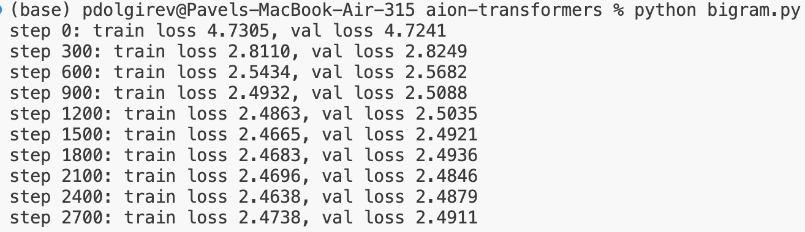
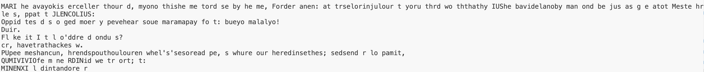
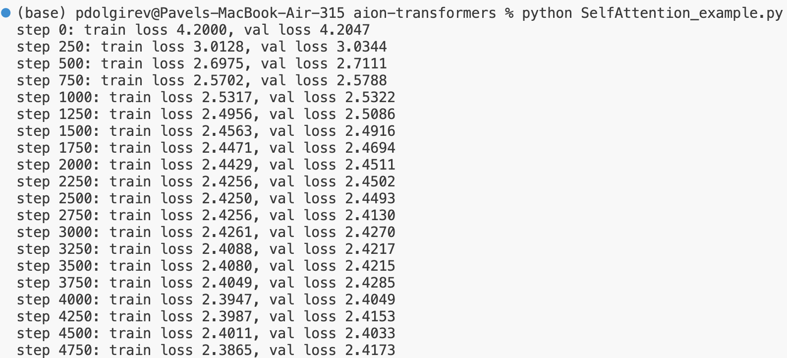
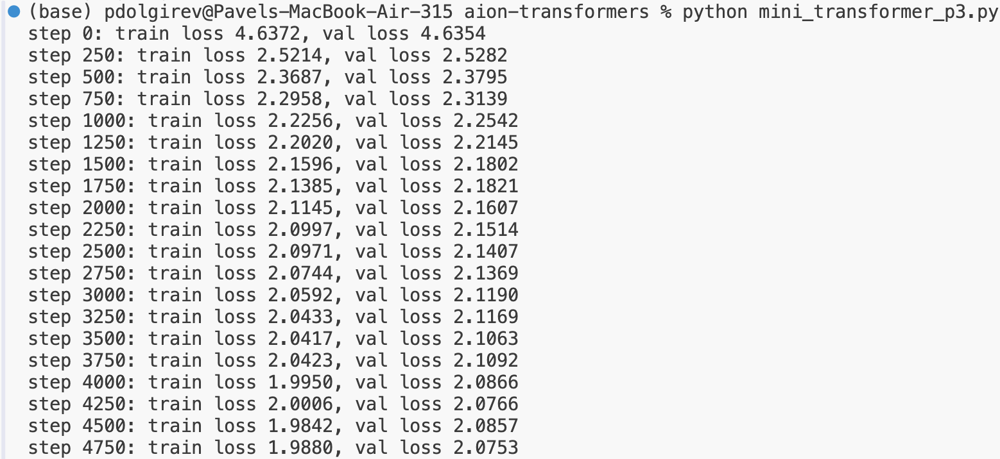
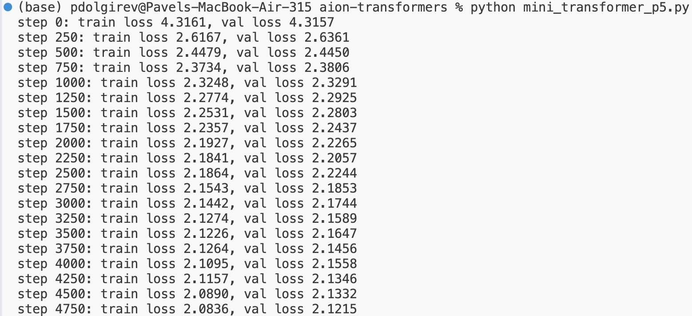

Transformer from Scratch

I am a theoretical physicist exploring modern AI architectures through first-hand prototyping.
This repository follows the superb lecture by Andrej Karpathy (https://www.youtube.com/watch?v=kCc8FmEb1nY&t=5065s), where I build a Transformer model from scratch — line by line — to internalize the self-attention mechanism in full detail. I am exploring if this mechanism, as well as other NN architectures (see my locality repo for an example), can be leveraged for my physics projects on quantum material design and processing quantum simulators data. Shoot me an email (p.e.dolgirev@gmail.com) if you have great insighs and want to collab.

📚 Foundational Readings

While training neural networks, I found the following works particularly illuminating:
1. Deep Residual Learning for Image Recognition (He et al., 2015, https://arxiv.org/abs/1512.03385). Key lesson: naively, one expects that a deeper NN with more model parameters would result in overfitting. This is not what is observed in practice. In practice, deeper NNs are more difficult to train, and the proposed residual architecture efficiently solves the training issue.
2. Attention Is All You Need — Vaswani et al., 2017, https://arxiv.org/abs/1706.03762. The original breakthrough paper introducing the Transformer architecture, based on the (self) attention mechanism, note the positional encoding.
3. 3Blue1Brown: Transformer Series — Chapters 5–7, https://www.youtube.com/watch?v=wjZofJX0v4M. A beautifully intuitive explanation of the self-attention mechanism, really complements the Attention Is All You Need paper. One particularly valuable insight is the idea of almost-orthogonal vectors in high-dimensional spaces — as the embedding dimension increases, the number of nearly orthogonal directions very grows rapidly, enabling the model to represent many distinct contexts within a rather compact latent space.
4. Murphy, Probabilistic Machine Learning: An Introduction — Chapters 13–15: concise and complete overview of deep learning fundamentals, love the rigor level of the book.
5. Dropout: A Simple Way to Prevent Neural Networks from Overfitting (Srivastava et al., 2014, https://jmlr.org/papers/volume15/srivastava14a/srivastava14a.pdf). Demonstrates that randomly removing nodes and corresponding connections during training effectively mitigates overfitting in large models with many parameters.
Dropout acts as a form of ensemble regularization (over many similar but distinct neural nets), forcing the network to learn more robust internal representations.

Part I: Bigram Model

(Run with: python bigram.py)
This is the simplest possible language model.
It learns only the conditional probability distribution $P(x_t| x_{t - 1})$, meaning the model predicts the next token solely from the current one — a context window of length 1.
Below is a screenshot of the model training. As expected, the validation loss remains relatively high, since the model ignores longer-range structure in the text:

And here is a 500-token sample generated from the trained model - interesting to see such an example explicitly, but clearly the model is far from the Tiny Shakespeare:

Part II: Self-Attention

Run: python SelfAttention_example.py to see an example with a single-head attention mechanism.
The masking used when computing wei (where the upper-triangular part is set to $-\infty$, see Head()) is reminiscent of the causality principle in physics -- tokens can only attend to past ones. This makes the self-attention mechanism feel almost physically grounded. If we extend the notion of keys and queries into a many-body quantum-physics context, they could represent operators designed to extract non-trivial correlations within the system. The transformer, in this sense, attempts to learn such operators automatically, suggesting that one may not need a full microscopic understanding of the system before analyzing it.
Here is the training progression -- we observe only a slight improvement over the bigram model; the generated text is not yet substantially better (not shown but is part of the script SelfAttention_example.py). There’s still a long way to go before the full transformer architecture comes together:

Run: python multi_head_sa_example.py to see an example with four attention heads. The validation error drops from about 2.4 \to about 2.28, a reduction comparable to the improvement achieved when moving from the bigram model to the single-head attention. 
This suggests that using multiple heads with smaller head sizes allows the model to extract more, partially independent correlation channels -- leading to a modest but meaningful performance gain.

Part III: Mini-transformer (add feed-forward NN, layer normalizaiton, repeat this block multiple times)

After adding a feed-forward neural network right after the multi-head attention layer (mini_transformer_p1.py), the validation error dropped further to about 2.2.
Next, following the lecture, I stacked three Transformer blocks (each consisting of multi-head attention followed by a feed-forward network; mini_transformer_p2.py).
Here I observed that:

- Training required many more epochs —- convergence became noticeably less efficient.

- The validation error appears roughly 0.1 higher than the training error, a sign of overfitting.

This suggested the need for regularization, motivating the introduction of dropout to mitigate overfitting.
Since learning also appeared less efficient, I subsequently added layer normalization and residual connections.

By adding residual connections (mini_transformer_p3.py), I observed a substantial improvement in training stability —- the validation error dropped to about 2.08 without the need to increase the number of epochs (the issue of overfitting still persisted):

Layer normalization (mini_transformer_p4.py) didn't seem to do much, barely improving the validation performance (by about 0.01) so far. Finally, dropout helped with overfitting quite effectively (mini_transformer_p5.py), as the training and validation errors became appreciably closer:

Part IV: Parameter choice, best model, and conclusions

Up to this point, there were many hyperparameters that made me a bit uneasy.
The most frustrating ones were the learning rate and the number of epochs. To address this, I added a learning-rate scheduler that automatically decreases the rate when the validation loss plateaus, ensuring a smoother and more stable convergence.
A second uncertainty was the number of Transformer blocks. I now scan this parameter from 1 to 4 to quantify its impact on performance.
Third, I wanted to understand the role of dropout, so I sweep over values [0.0, 0.1, 0.2] to examine how regularization affects the training and generalization.
There are, of course, many other hyperparameters of interest -- such as the number of hidden layers in the feed-forward network, the embedding dimensionality n_embd, and the number of attention heads.
Guided by Karpathy’s lecture, I increased these values moderately compared to the earlier parts of this project, balancing expressivity and runtime. The full set of experiments and chosen parameters are implemented in find_best_minitransformer.py.
For practical reasons, I use smaller architectures compared to the final architecture in the lecture so that the code can run on a laptop CPU/GPU. In a real research setting, I would scale up the model and launch the parameter sweeps on a GPU server for a thorough search.
Curious readers are encouraged to experiment with these hyperparameters themselves -- the framework is already designed to make such exploration straightforward.